# 第01章：LangChain使用概述

讲师：尚硅谷-宋红康

官网：[尚硅谷][https://www.atguigu.com/]

***

**大模型相关的岗位：**

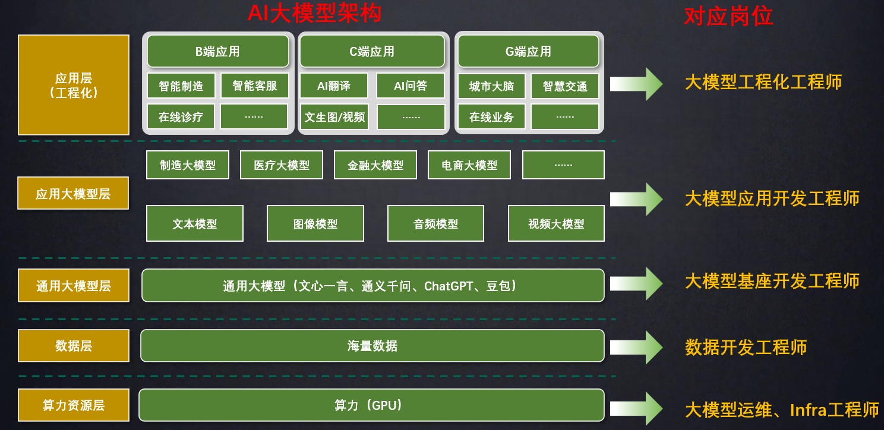

应用开发是大模型最值得关注的方向：应用为王！

学习LangChain框架，高效开发大模型应用

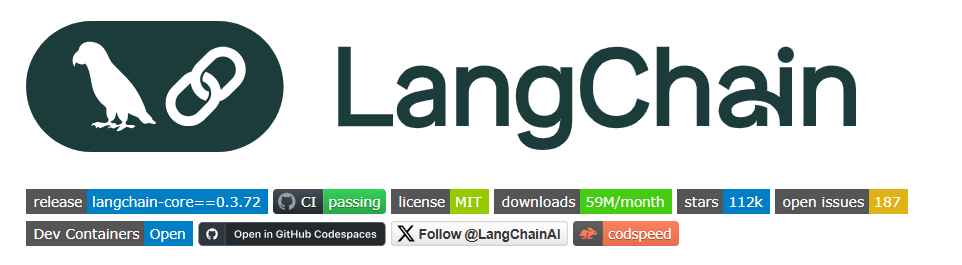


## 1、介绍LangChain

### 1.1 什么是LangChain

LangChain是`2022年10月`，由哈佛大学的`Harrison Chase`（哈里森·蔡斯）发起研发的一个开源框架，用于开发由大语言模型（LLMs）驱动的应用程序。

> 比如，搭建“智能体”（Agent）、问答系统（QA）、对话机器人、文档搜索系统等。

> LangChain的发布比ChatGPT问世还要早一个月，他那时候是怎么发现大模型要火的？

> 从这个启动日期也可以看出创始人的眼光，这比ChatGPT问世还要早一个月呢，他那时候是怎么发现大模型要火的？占了先机的它迅速获得广泛关注和支持！

**LangChain在Github上的热度变化**

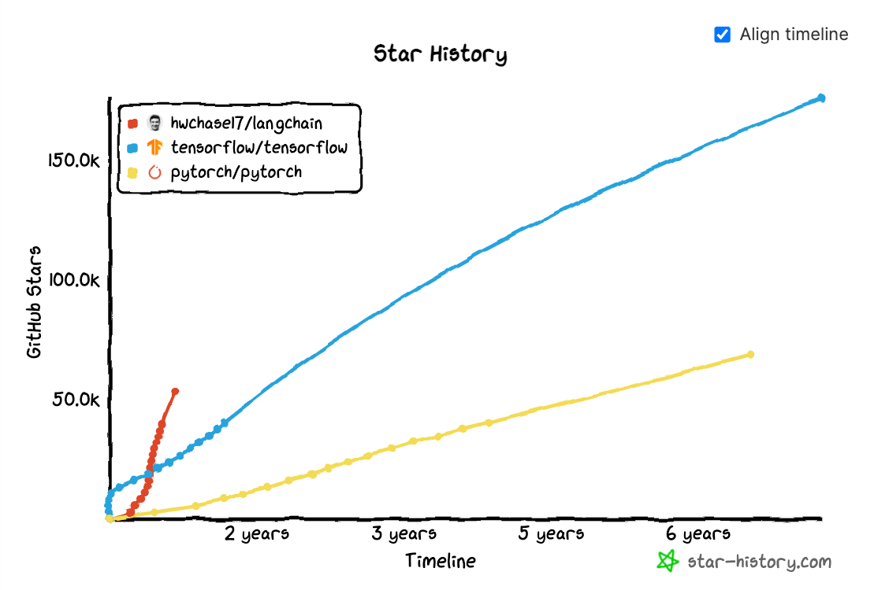

**LangChain在Github上的star**

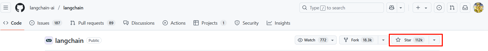

https://github.com/langchain-ai/langchain

**简单概括**

LangChain ≠ LLMs

LangChain 之于 LLMs，类似 Spring 之于 Java

LangChain 之于 LLMs，类似 Django 之于 Python

> 顾名思义，LangChain中的“Lang”是指language，即大语言模型，“Chain”即“链”，也就是将大模型与外部数据&各种组件连接成链，以此构建AI应用程序。
>


### 1.2 有哪些大模型应用开发框架呢？

截止到2025年7月26日，GitHub统计数据：

 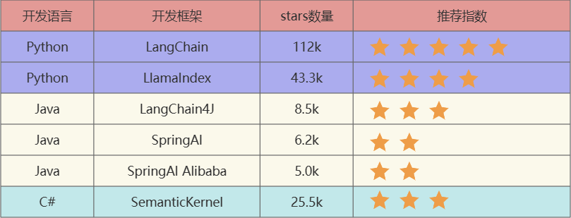

- `LangChain`：这些工具里出现最早、最成熟的，适合复杂任务分解和单智能体应用
- `LlamaIndex`：专注于高效的索引和检索，适合 RAG 场景。（注意不是Meta开发的）
- `LangChain4J`：LangChain出了Java、JavaScript（**LangChain.js**）两个语言的版本，LangChain4j的功能略少于LangChain，但是主要的核心功能都是有的
- `SpringAI/SpringAI Alibaba`：有待进一步成熟，此外只是简单的对于一些接口进行了封装
- `SemanticKernel`：也称为sk，微软推出的，对于C#同学来说，那就是5颗星


### 1.3 为什么需要LangChain？

**问题1：LLMs用的好好的，干嘛还需要LangChain？**

在大语言模型（LLM）如 ChatGPT、Claude、DeepSeek 等快速发展的今天，开发者不仅希望能“使用”这些模型，还希望能`将它们灵活集成到自己的应用中`，实现更强大的对话能力、检索增强生成（RAG）、工具调用（Tool Calling）、多轮推理等功能。


> 大模型默认不能联网，如果需要联网，用langchain。
>
> LangChain 为更方便解决这些问题，而生的。


**问题2：我们可以使用GPT 或GLM4 等模型的API进行开发，为何需要LangChain这样的框架？**

不使用LangChain，确实可以使用GPT 或GLM4 等模型的API进行开发。比如，搭建“智能体”（Agent）、问答系统（QA）、对话机器人、文档搜索系统等复杂的 LLM 应用。

但使用LangChain的好处：

- **简化开发难度**：更简单、更高效、效果更好

  > 开发人员可以更专注于业务逻辑，而无须花费大量时间和精力处理底层技术细节。

- **学习成本更低**：不同模型的API不同，调用方式也有区别，切换模型时学习成本高。使用LangChain，可以以统一、规范的方式进行调用，有更好的移植性。

- **现成的链式组装**：LangChain提供了一些`现成的链式组装`，用于完成特定的高级任务。让复杂的逻辑变得`结构化、易组合、易扩展`

  > 你做过GPT或GLM4的API做过项目以后，你再用langchain会更有感觉。

  


**问题3：LangChain 提供了哪些功能呢？**

LangChain 是一个帮助你构建 LLM 应用的`全套工具集`。这里涉及到prompt 构建、LLM 接入、记忆管理、工具调用、RAG、智能体开发等模块。

> 学习 LangChain 最好的方式就是做项目。

### 1.4 LangChain的使用场景

学完LangChain，如下类型的项目，大家都可以实现：

**项目类型1：文档问答助手**

`案例`：企业使用 LangChain 加载内部文档（如员工手册、产品说明），结合向量存储（如 Pinecone）实现语义搜索，回答员工或客户的问题。

`示例`：新员工入职培训中，销售岗位有哪些注意事项呢？检索相关手册并生成自然语言回答。

`场景`：基于私有或外部数据构建问答系统。

**项目类型2：智能助理开发**

`案例`：LangChain 的 Agent 模块（如 ReAct Agent）结合工具，完成任务。

`示例1`：用户请求调用天气 API、计算器和日历，规划户外旅游活动。

`示例2`：结合使用Google Search、Firecrawl网页爬取工具，实现“分析某股票趋势并生成报告”的任务

`场景`：构建自主决策的智能体，执行复杂任务。

**项目类型3：对话聊天机器人**

`案例`：电商平台使用 LangChain 的 ConversationChain，结合 ConversationBufferMemory，记录用户历史对话，提供个性化客服。

`示例`：用户问“推荐一款跑鞋”，机器人根据之前提到的偏好（如“喜欢轻量鞋”）推荐合适产品。

`场景`：开发上下文感知的聊天机器人，支持多轮对话。

**项目类型4：数据分析与洞察生成**

`案例`：金融分析师使用 LangChain 加载 CSV 数据，结合 LLM 分析销售趋势，生成自然语言报告。

`示例`：从销售数据中提取“哪些产品在特定地区销量最高”并生成可视化描述。

`场景`：处理结构化或非结构化数据，生成报告或洞察。

**项目类型5：多模态应用**

`案例`：平台使用 LangChain 结合 CLIP 模型，分析产品图片、视频等，生成高质量回复。

`示例1`：教育平台分析教学视频和讲义，生成互动式学习内容。

`示例2`：零售平台结合产品图片和描述，回答“哪些产品适合户外使用？”

`场景`：结合文本、图像、语音等多模态数据。

**项目类型6：教育与学习助手**

`案例`：在线教育平台使用 LangChain 构建数学助手，结合 Wolfram Alpha 工具解答复杂公式。

`示例`：学生提问“积分的定义”，LangChain 检索教材并生成逐步讲解。

`场景`：开发个性化教育工具，支持学习和练习。

**项目类型7：自动化工作流**

`案例`：营销团队使用 LangChain 整合市场数据，自动生成社交媒体帖子。

`示例`：从 CRM 数据生成客户跟进邮件，结合日历安排发送时间。

`场景`：自动化复杂业务流程，如报告生成、任务调度。

**项目类型8：研究与创新**

`案例`：研究者使用 LangChain 分析文献，结合知识图谱提取跨领域的概念关系。

`示例`：从气候变化文献中提取关键趋势，生成研究报告。

`场景`：支持学术或行业研究，挖掘数据关联。


### 1.5 LangChain资料介绍

github地址：https://github.com/langchain-ai/langchain

官网地址：https://www.langchain.com/langchain

官网文档：https://python.langchain.com/docs/introduction/

中文文档：https://www.langchain.com.cn/

API 文档：https://python.langchain.com/api_reference/

Java版本：https://github.com/langchain4j/langchain4j


### 1.6 架构设计

#### 1.6.1 总体架构图

##### V0.1 版本

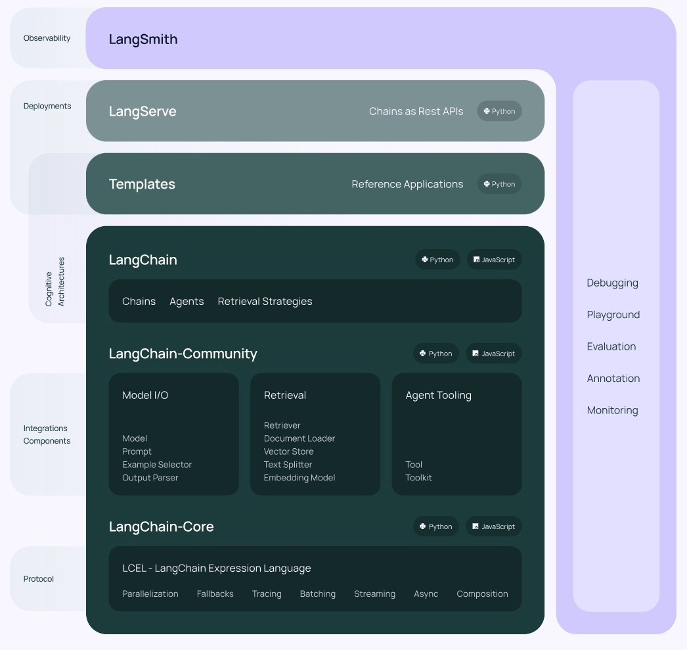

##### V0.2 / V0.3 版本

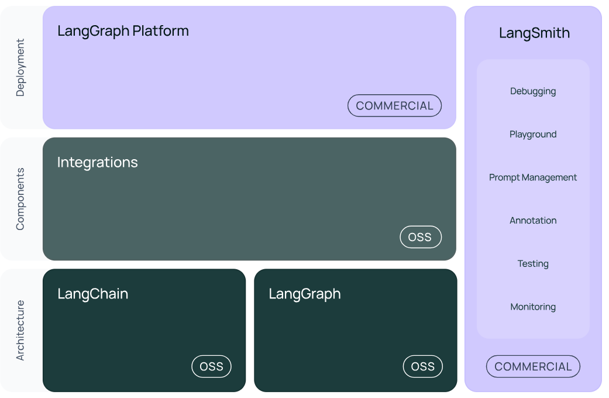

图中展示了LangChain生态系统的主要组件及其分类，分为三个层次：架构(Architecture)、组件(Components)和部署(Deployment)。

- 最底层是`架构部分`，包括LangChain和LangGraph，它们均开源(OSS)。
- 中间层是`组件部分`，标注为开源(OSS)的Integrations模块，负责与外部工具或服务集成，例如与API、数据库或第三方模型交互，支持灵活扩展与适配。
- 最顶层是`部署部分`，包括LangGraph Cloud和LangSmith。其中：LangGraph Cloud是商业化的云端解决方案，支持跨平台部署与管理，LangSmith后面介绍。

> 版本的升级，主要是往稳定性（或兼容性）、安全性上使劲了，支持更多的大模型，更安全。v0.2 相较于v0.1，修改大概10%-15%。功能性上差不多。

#### 1.6.2 内部架构详情

##### 结构1：LangChain

**langchain-Core**：基础抽象和LangChain表达式语言 (LCEL)

**langchain-community**：第三方集成

> 比如：Model I/O、Retrieval、Tool & Toolkit；合作伙伴包 langchain-openai，langchain-anthropic等。

**langchain**：构成应用程序认知架构的Chains，Agents，Retrieval strategies等

> 构成应用程序的链、智能体、RAG。
>
> LangChain：就是封装了一堆的API。langchain框架不大，但是里面琐碎的知识点特别多。
>

##### 结构2：LangGraph

https://langchain-ai.github.io/langgraph/concepts/why-langgraph/

LangGraph可以看做基于LangChain的api的进一步封装，能够协调多个Chain、Agent、Tools完成更复杂的任务，实现更高级的功能。

> LangGraph：可以看做基于LangChain的api的进一步封装，可以实现更高级的功能。未来会单拿出来。

##### 结构3：LangSmith

https://docs.smith.langchain.com/

链路追踪。提供调试、交互式测试环境、评估和监控 LLM 应用程序等功能，便于持续优化，帮助你从原型阶段过渡到生产阶段。  与LangChain无缝集成

> 起到运维或监控的功能。（可视化的监控一些指标）
>
> 正是因为LangSmith这样的工具出现，才使得LangChain意义更大，要不仅靠一些API（当然也可以不用，用原生的API），支持不住LangChain的热度。

##### 结构4：LangServe

http://www.aidoczh.com/langchain/v0.2/docs/langserve/

将LangChain的可运行项和链部署为REST API，使得它们可以通过网络进行调用。

> Java怎么调用langchain呢？就通过这个langserve。将langchain应用包装成一个rest api，对外暴露服务。同时，支持更高的并发，稳定性更好。
>
> langserve做部署，不用它的话，我们也可以自己搞定，所以重要性也就那样。

总结：LangChain当中，最有前途的两个模块就是：LangGraph，LangSmith。

> LangChain能做RAG，其它的一些框架也能做，而且做的也不错，比如LlamaIndex。所以这时候LangChain要在Agent这块发力，那就需要LangGraph。而LangSmith，做运维、监控。故，二者是LangChain里最有前途的。
>


## 2、开发前的准备工作

### 2.1 前置知识

**1、Python 基础语法**

-  变量、函数、类、装饰器、上下文管理器 
-  模块导入、包管理（推荐用 `pip` 或 `conda`） 

**2、大语言模型基础**

-  了解什么是 LLM、Token、Prompt、Embedding
-  OpenAI API 或其他模型提供商（如 Anthropic、Cohere） 

**3、其它方面**

- 了解JSON等数据结构
- 了解基本的程序执行流程能力

### 2.2 相关环境安装

**1、安装Python或Anaconda**

LangChain基于Python开发，因此需确保系统中安装了Python。

`方式1`：直接下载Python安装包。推荐版本为Python 3.10及以上

Python官网：https://www.python.org/

`方式2`：使用包管理工具（如Anaconda）进行安装。通过Anaconda可以轻松创建和管理虚拟环境，为项目提供独立的依赖空间，避免不同项目之间的依赖冲突。

具体操作见`《尚硅谷-conda使用指南.md》`


**2、创建虚拟环境**

为了保持项目的独立性与环境的干净，建议使用虚拟环境。可以在Anaconda中创建虚拟环境。

具体操作见`《尚硅谷-conda使用指南.md》`

验证Python版本：在激活的虚拟环境中，输入以下命令验证Python版本是否正确：

```bash
python --version
```


**3、如何下载安装包**

比如：安装langchain包

`方式1：使用pip指令`

基础指令

```bash
# 安装包（默认最新版）
pip install langchain

# 指定版本
pip install langchain==0.3.7

# 批量安装（空格分隔）
pip install langchain requests numpy

# 升级包
pip install --upgrade langchain

# 卸载包
pip uninstall langchain

# 查看已安装包
pip list
```

高级操作

```bash
# 国内镜像加速 （解决下载慢）  -i：指定镜像源
pip install -i https://mirrors.aliyun.com/pypi/simple/ langchain

# 从本地/URL安装：
pip install ./local_package.whl
pip install https://github.com/user/repo/archive/main.zip
```

`方式2：使用conda指令`

```bash
# 安装包（默认仓库）
conda install langchain

# 指定频道（如 conda-forge）
conda install -c conda-forge langchain==0.3.7

# 更新包
conda update langchain

# 卸载包
conda uninstall langchain

# 查看已安装包
conda list
```

> `-c`：是`--channel`的缩写，conda用于指定包的安装来源渠道。
>
> `conda-forge`：该源比官方默认渠道更新更快、包更全

`建议：`二者最好不好混用，推荐先conda装基础包，后 pip补充的顺序。

```bash
# 检查包来源
conda list   # Conda 安装的包显示频道，pip 安装的显示 `pypi`
```

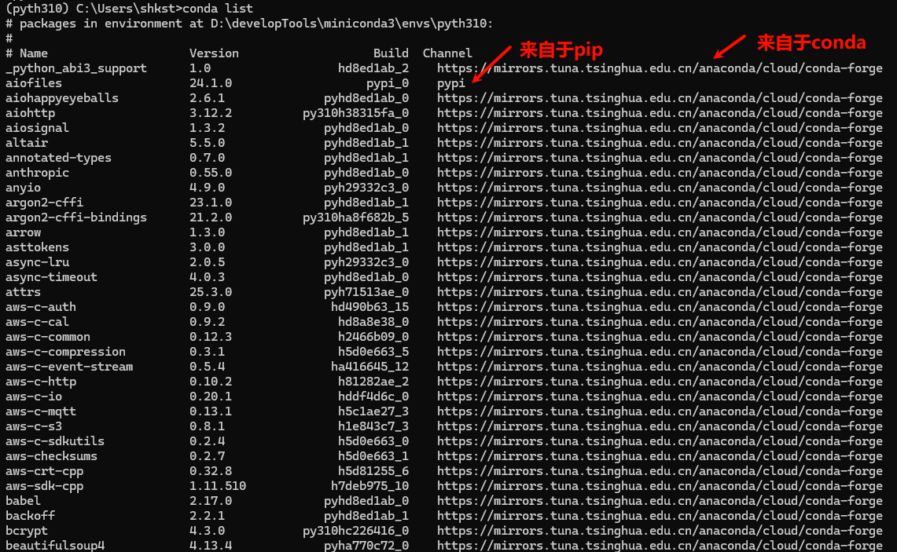

**4、PyCharm开发环境**

PyCharm作为专业的Python IDE，具有强大的代码编辑、调试和版本控制功能。

 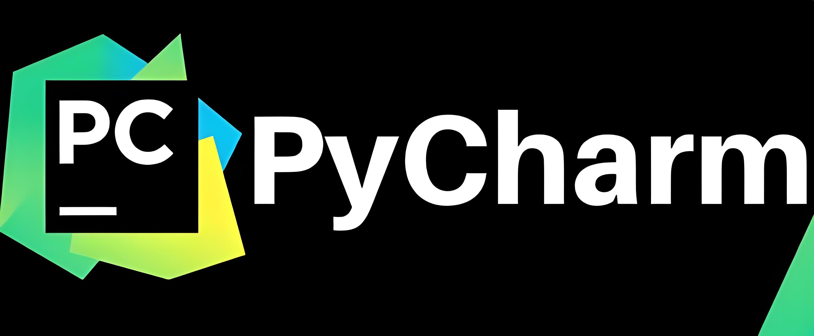

创建新的工程，并设置Python解释器（选择Anaconda环境）。

``` python
import langchain

print(langchain.__version__)  # 0.3.25
```

``` python
import openai
print(openai.__version__)  # 1.81.0
```

```python
import sys

#查看python的版本
print(sys.version)  # 3.10.17 | packaged by conda-forge | (main, Apr 10 2025, 22:06:35) [MSC v.1943 64 bit (AMD64)]
```


## 3、大模型应用开发

大模型应用技术特点：门槛低，天花板高。

### 3.1 基于RAG架构的开发

**背景：**

- 大模型的知识冻结
- 大模型幻觉

> 随着 LLM 规模扩大，训练成本与周期相应增加。因此，包含最新信息的数据难以融入模型训练过程，无法及时反映最新的信息或动态变化。导致 LLM 在应对诸如“请推荐当前热门影片”等时间敏感性问题。

**举例：**

LLM在考试的时候面对陌生的领域，答复能力有限，然后就准备放飞自我了，而此时RAG给了一些提示和思路，让LLM懂了开始往这个提示的方向做，最终考试的正确率从60%到了90%！


**何为RAG？**

Retrieval-Augmented Generation（检索增强生成）


> 检索-增强-生成过程：检索可以理解为第10步，增强理解为第13步（这里的提示词包含检索到的数据），生成理解为第15步。
>


> 原始数据处理后得到的文件比较大，不利于检索，需要切割成一小片一小片的知识点。接着对这些知识进行向量化，向量化以后存储到向量数据库。
>
> 检索算法，比如有向量相似度算法。
>
> 从向量数据库检出的数据会存在噪声，会有一些与答案没关的内容。我们需要用重排序的算法，对知识进行整理，生成的新的chunks，结合原有的Prompt，封装成新的提示词，给到大模型，产生最后答案。
>
> 这些过程中的难点：1、文件解析 2、文件切割  3、知识检索   4、知识重排序
>
> 1、文件解析：如果是pdf，内部包含文件、图片、表格，图片上还有文字，需要处理。
>
> 2、文件切割：没有固定的格式
>
> 3、在 RAG 应用中，随着文档数量增加，召回准确率会下降，引入reranker（重排器）可对初步召回的较多 chunk（如 top 20 或 top 50）进行精排，提高召回准确率，防止LLM 处理无关信息，减少时间和成本。
>
> 此外，与基于基本矢量搜索的 RAG 相比，reranker增强型 RAG 的成本更高，但与仅依靠LLM 生成答案相比，它的成本低些。

**Reranker的使用场景：**

- 适合：追求`回答高精度`和`高相关性`的场景中特别适合使用 Reranker，例如专业知识库或者客服系统等应用。
- 不适合：引入reranker会增加召回时间，增加检索延迟。服务对`响应时间要求高`时，使用reranker可能不合适。

### 3.2 基于Agent架构的开发

充分利用 LLM 的推理决策能力，通过增加`规划`、`记忆`和`工具`调用的能力，构造一个能够独立思考、逐步完成给定目标的智能体。

举例：传统的程序 vs Agent

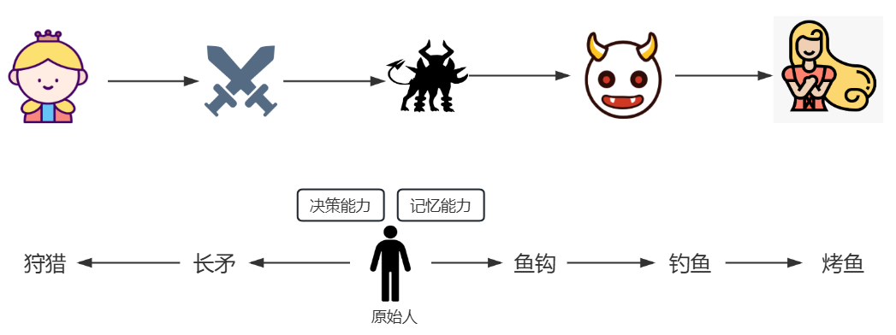

OpenAI的元老翁丽莲(Lilian Weng)于2023年6月在个人博客首次提出了现代AI Agent架构。 


一个数学公式来表示：

**Agent = LLM + Memory + Tools + Planning +  Action**

> 比如，打车到西藏玩。
>
> - 大脑中枢：规划行程的你
>
> - 规划：步骤1：规划打车路线，步骤2：定饭店、酒店，。。。
> - 调用工具：调用MCP或FunctionCalling等API，滴滴打车、携程、美团订酒店饭店
> - 记忆能力：沟通时，要知道上下文。比如定酒店得知道是西藏路上的酒店，不能聊着聊着忘了最初的目的。
> - 能够执行上述操作。说走就走，不能纸上谈兵。

智能体核心要素被细化为以下模块：

**1、大模型（LLM）作为“大脑”**：提供推理、规划和知识理解能力，是AI Agent的决策中枢。

> 大脑主要由一个大型语言模型 LLM 组成，承担着信息处理和决策等功能， 并可以呈现推理和规划的过程，能很好地应对未知任务。

**2、记忆（Memory）**  

> 智能体像人类一样，能留存学到的知识以及交互习惯等，这样的机制能让智能体在处理重复工作时调用以前的经验，从而避免用户进行大量重复交互。

- **短期记忆**：存储单次对话周期的上下文信息，属于临时信息存储机制。受限于模型的上下文窗口长度。  

  

  > ChatGPT：支持约8k token的上下文
  >
  > GPT4：支持约32k token的上下文
  >
  > 最新的很多大模型：都支持100万、1000万 token的上下文 （相当于2000万字文本或20小时视频）
  >
  > 1个Token对应约1.5-1.8个汉字。例如，若中文文本包含1000个汉字，则对应约1500-1800个Token。

- **长期记忆**：可以横跨多个任务或时间周期，可存储并调用核心知识，非即时任务。

  - 长期记忆，可以通过**模型参数微调（固化知识）**、**知识图谱（结构化语义网络）**或**向量数据库（相似性检索）**方式实现。


> 以人作类比：
>
> - 短期记忆：在进行心算时临时记住几个数字
> - 长期记忆：学会骑自行车后，多年后再次骑起来时仍能掌握这项技能

**3、工具使用（Tool Use）**：调用外部工具（如API、数据库）扩展能力边界。


**4、规划决策（Planning）**：通过任务分解、反思与自省框架实现复杂任务处理。例如，利用思维链（Chain of Thought）将目标拆解为子任务，并通过反馈优化策略。


**5、行动（Action）**：实际执行决策的模块，涵盖软件接口操作（如自动订票）和物理交互（如机器人执行搬运）。比如：检索、推理、编程等。

> 智能体会形成完整的计划流程。例如先读取以前工作的经验和记忆，之后规划子目标并使用相应工具去处理问题，最后输出给用户并完成反思。 

### 3.3 大模型应用开发的4个场景

#### 场景1：纯 Prompt

- Prompt是操作大模型的唯一接口
- 当人看：你说一句，ta回一句，你再说一句，ta再回一句...


#### 场景2：Agent + Function Calling

- Agent：AI 主动提要求
- Function Calling：需要对接外部系统时，AI 要求执行某个函数
- 当人看：你问 ta「我明天去杭州出差，要带伞吗？」，ta 让你先看天气预报，你看了告诉ta，ta 再告诉你要不要带伞

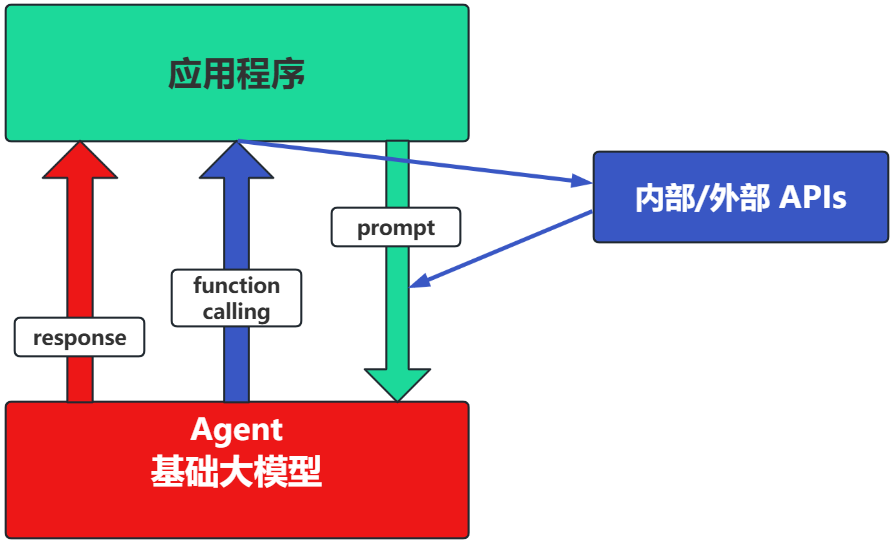

#### 场景3：RAG (Retrieval-Augmented Generation)

RAG：需要补充领域知识时使用

- Embeddings：把文字转换为更易于相似度计算的编码。这种编码叫向量
- 向量数据库：把向量存起来，方便查找
- 向量搜索：根据输入向量，找到最相似的向量

举例：考试答题时，到书上找相关内容，再结合题目组成答案

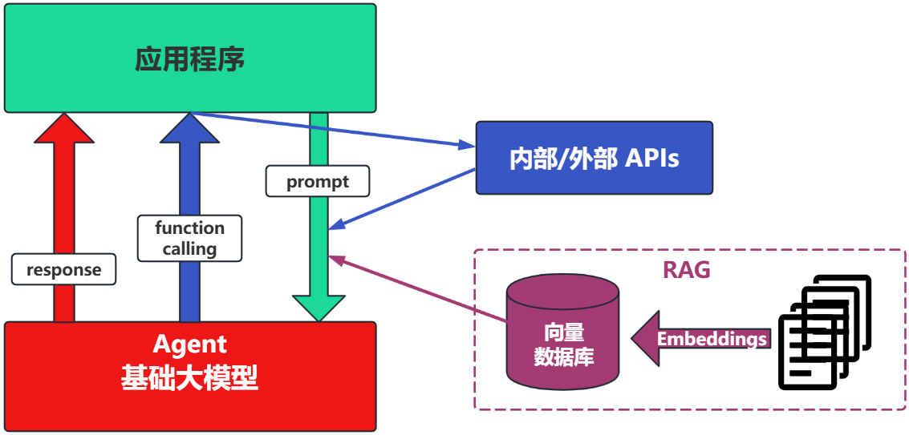

这个在智能客服上用的最广泛。


#### 场景4：Fine-tuning(精调/微调)

举例：努力学习考试内容，长期记住，活学活用。

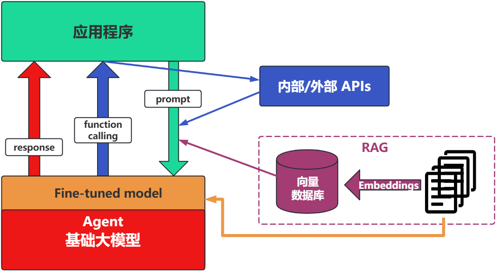

特点：成本最高；在前面的方式解决不了问题的情况下，再使用。

#### 如何选择

面对一个需求，如何开始，如何选择技术方案？下面是个常用思路：

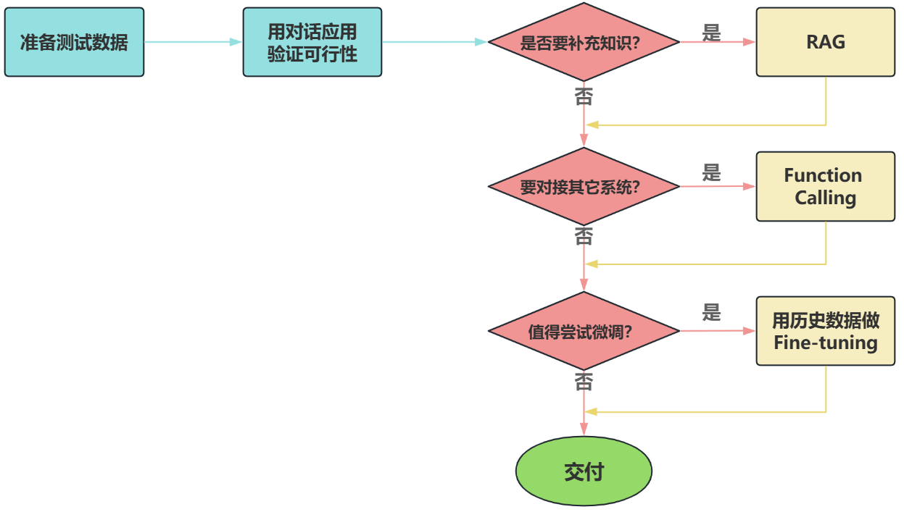

> 注意：其中最容易被忽略的，是准备测试数据

**下面，我们重点介绍下大模型应用的开发两类：基于RAG的架构，基于Agent的架构。**

## 4、LangChain的核心组件

学习Langchain最简单直接的方法就是阅读官方文档。

https://python.langchain.com/v0.1/docs/modules/

通过文档目录我们可以看到，Langchain构成的核心组件。

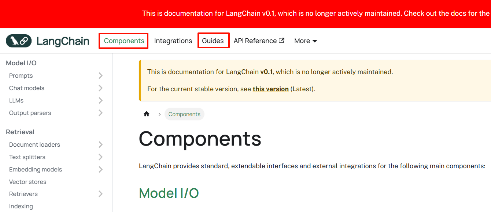

> 两个红框内容是核心。中间的Integrations：集成各种工具或云平台。

### 4.1 一个问题引发的思考

**如果要组织一个AI应用，开发者一般需要什么？**

第1，提示词模板的构建，不仅仅只包含用户输入。

第2，模型调用与返回，参数设置，返回内容的格式化输出。

第3，知识库查询，这里会包含文档加载，切割，以及转化为词嵌入（Embedding）向量。

第4，其他第三方工具调用，一般包含天气查询、Google搜索、一些自定义的接口能力调用。

第5，记忆获取，每一个对话都有上下文，在开启对话之前总得获取到之前的上下文吧？


### 4.2 核心组件的概述

LangChain的核心组件涉及六大模块，这六大模块提供了一个全面且强大的框架，使开发者能够创建复杂、高效且用户友好的基于大模型的应用。

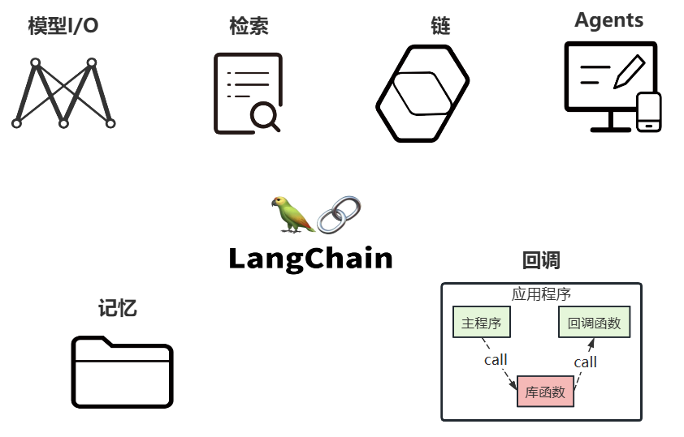

### 4.3 核心组件的说明

#### 核心组件1：Model I/O

> 这个模块使用最多，也最简单

Model I/O：标准化各个大模型的输入和输出，包含输入模版，模型本身和格式化输出。

以下是使用语言模型从输入到输出的基本流程。


以下是对每一块的总结：

- `Format(格式化)`：即指代Prompts Template，通过模板管理大模型的输入。将原始数据格式化成模型可以处理的形式，插入到一个模板问题中，然后送入模型进行处理。
- `Predict(预测)`：即指代Models，使用通用接口调用不同的大语言模型。接受被送进来的问题，然后基于这个问题进行预测或生成回答。
- `Parse(生成)`：即指代Output Parser 部分，用来从模型的推理中提取信息，并按照预先设定好的模版来规范化输出。比如，格式化成一个结构化的JSON对象。

#### 核心组件2：Chains

Chain："链条"，用于将多个模块串联起来组成一个完整的流程，是 LangChain 框架中最重要的模块。

例如，一个 Chain 可能包括一个 Prompt 模板、一个语言模型和一个输出解析器，它们一起工作以处理用户输入、生成响应并处理输出。

**常见的Chain类型：**

-  `LLMChain`：最基础的模型调用链 
-  `SequentialChain`：多个链串联执行 
-  `RouterChain`：自动分析用户的需求，引导到最适合的链
-  `RetrievalQA`：结合向量数据库进行问答的链

#### 核心组件3：Memory

Memory：记忆模块，用于保存对话历史或上下文信息，以便在后续对话中使用。

**常见的 Memory 类型：**

-  `ConversationBufferMemory`：保存完整的对话历史
-  `ConversationSummaryMemory`：保存对话内容的精简摘要（适合长对话） 
-  `ConversationSummaryBufferMemory`：混合型记忆机制，兼具上面两个类型的特点
-  `VectorStoreRetrieverMemory`：保存对话历史存储在向量数据库中

#### 核心组件4：Agents

Agents，对应着智能体，是 LangChain 的高阶能力，它可以自主选择工具并规划执行步骤。

**Agent 的关键组成：**

-  `AgentType`：定义决策逻辑的工作流模式
-  `Tool`：是一些内置的功能模块，如API调用、搜索引擎、文本处理、数据查询等工具。Agents通过这些工具来执行特定的功能。
-  `AgentExecutor`：用来运行智能体并执行其决策的工具，负责协调智能体的决策和实际的工具执行。

> 目前最热门的智能体开发实践，未来能够真正实现通用人工智能的落地方案。
>
> 这里的Agent，就会涉及到前面讲的memory，以及tools。


#### 核心组件5：Retrieval

Retrieval：对应着RAG，检索外部数据，然后在执行生成步骤时将其传递到 LLM。步骤包括文档加载、切割、Embedding等


- `Source`：数据源，即大模型可以识别的多种类型的数据：视频、图片、文本、代码、文档等。
- `Load`：负责将来自不同数据源的非结构化数据，加载为文档(Document)对象
- `Transform`：负责对加载的文档进行转换和处理，比如将文本拆分为具有语义意义的小块。
- `Embed`：将文本编码为向量的能力。一种用于嵌入文档，另一种用于嵌入查询
- `Store`：将向量化后的数据进行存储
- `Retrieve`：从大规模文本库中检索和查询相关的文本段落

> 绿色的是入库存储前的操作。
>


#### 核心组件6：Callbacks

Callbacks：回调机制，允许连接到 LLM 应用程序的各个阶段，可以监控和分析LangChain的运行情况，比如日志记录、监控、流传输等，以优化性能。

> 回调函数，对于程序员们应该都不陌生。这个函数允许我们在LLM的各个阶段使用各种各样的“钩子”，从而达实现日志的记录、监控以及流式传输等功能。
>

### 4.4 小结

- Model I/O模块：使用最多，也最简单
- Chains 模块： 最重要的模块
- Retrieval模块、Agents模块：大模型的主要落地场景

在这个基础上，其它组件要么是它们的辅助，要么只是完成常规应用程序的任务。

> 辅助：比如，向量数据库的分块和嵌入，用于追踪、观测的Callbacks
>
> 任务：比如，Tools，Memory

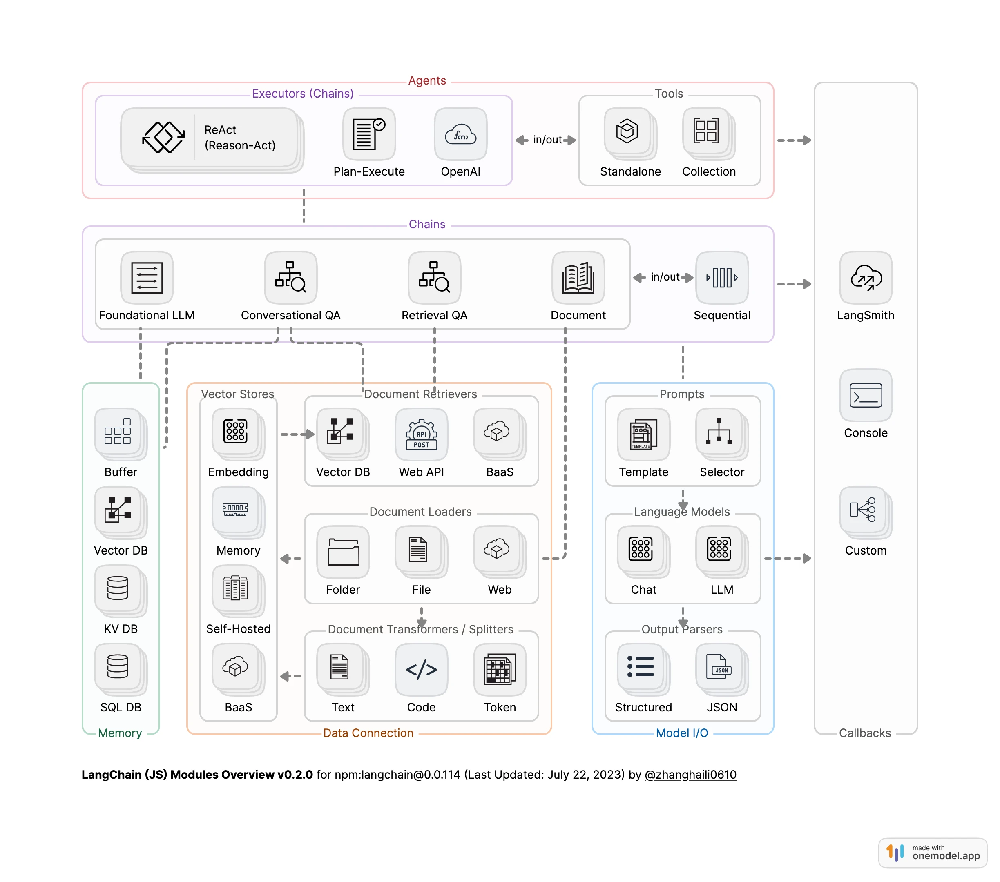

> 我们要做的就是一个一个module去攻破，最后将他们融会贯通，也就成为一名合格的LangChain学习者了。
>


下图展示了一个由LangChain Agent驱动的典型的大模型系统设计架构。

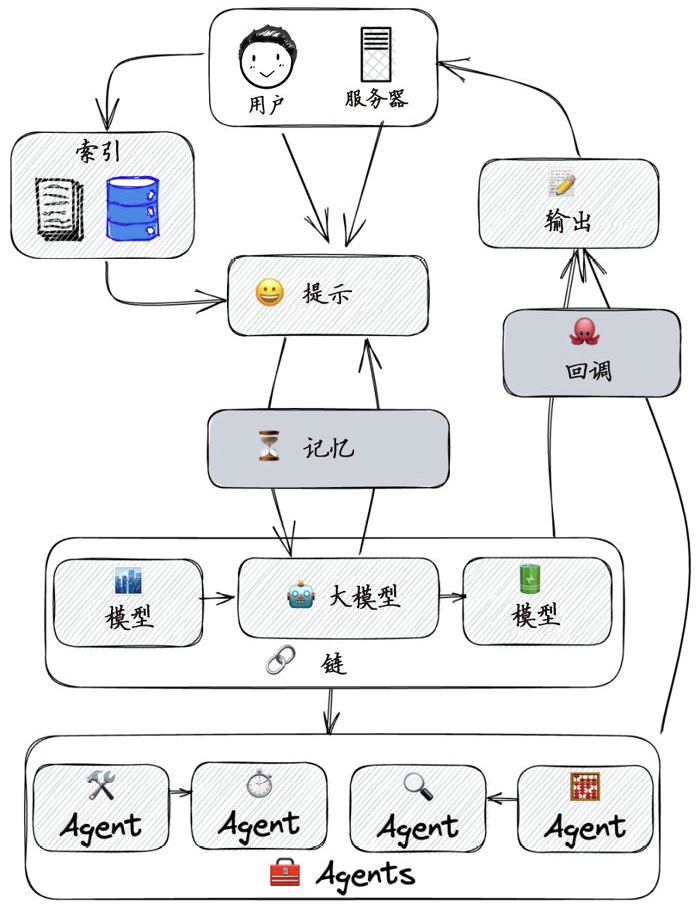

> 上图所示的架构中，用户通过服务器提供提示(Prompt)，系统则通过索引（Indexes，也就是Retrieval）检索信息。这些信息被用来更新系统的记忆(Memory)，为处理用户的输入提供上下文。
>
> 系统核心是模型(Model)，其中包括一个大模型，可能是用于理解和生成语言的AI。大模型通过链(Chains)与其他模型相连，这可能意味着不同模型之间的信息流动和合作。
>
> 在系统底部，多个Agent负责执行具体任务。它们可以完成不同的操作，并且可以独立工作。每个Agent都可能代表系统中的一个功能模块或服务。
>
> 用户的提示被模型处理后，系统产生输出(Output)，并可能通过回调(Callbacks)触发额外的动作或处理，这通常用于处理异步事件或在满足某些条件时执行特定的函数。
>
> 整个过程形成了一个从输入到输出的循环，涉及信息检索、记忆更新、模型处理和动作执行，最终达到响应用户请求的目的。
>


## 5、LangChain的helloworld(重构)

### 5.1 获取大模型

```python
#导入 dotenv 库的 load_dotenv 函数，用于加载环境变量文件（.env）中的配置
import dotenv
from langchain_openai import ChatOpenAI
import os

dotenv.load_dotenv()  #加载当前目录下的 .env 文件

os.environ['OPENAI_API_KEY'] = os.getenv("OPENAI_API_KEY1")
os.environ['OPENAI_BASE_URL'] = os.getenv("OPENAI_BASE_URL")

# 创建大模型实例
llm = ChatOpenAI(model="gpt-4o-mini")  # 默认使用 gpt-3.5-turbo

# 直接提供问题，并调用llm
response = llm.invoke("什么是大模型？")
print(response)
```

> content='大模型（Large Model）通常是指在深度学习和机器学习领域中，拥有大量参数和复杂结构的模型。这些模型可以处理复杂的数据集，进行高级的任务，如自然语言处理、图像识别、生成对抗网络等。以下是一些关于大模型的关键点：\n\n1. **参数量**：大模型通常具备数亿甚至数千亿个参数，这使得它们能够学习到更加丰富的特征和关系。\n\n2. **计算需求**：由于其庞大的规模，大模型通常需要高性能的计算资源，例如GPU或TPU，以及长时间的训练过程。\n\n3. **数据需求**：训练大模型通常需要大量的数据，以确保模型能够在各种情况下进行有效的学习和泛化。\n\n4. **应用广泛**：大模型在许多领域都有应用，包括语言模型（如GPT-3、BERT等）、图像处理（如卷积神经网络）以及生成模型（如GAN）。\n\n5. **转移学习**：许多大模型允许通过转移学习的方式进行微调，使得它们能够在特定任务上表现良好，而无需从头开始训练。\n\n大模型的出现大大推动了人工智能的发展，使得许多复杂的任务变得可行，并且在多个领域取得了显著的成果。' additional_kwargs={'refusal': None} response_metadata={'token_usage': {'completion_tokens': 289, 'prompt_tokens': 12, 'total_tokens': 301, 'completion_tokens_details': {'accepted_prediction_tokens': 0, 'audio_tokens': 0, 'reasoning_tokens': 0, 'rejected_prediction_tokens': 0}, 'prompt_tokens_details': {'audio_tokens': 0, 'cached_tokens': 0}}, 'model_name': 'gpt-4o-mini-2024-07-18', 'system_fingerprint': 'fp_efad92c60b', 'id': 'chatcmpl-BxO81Kq8FpSQgLyTikWfGzOlry2MF', 'service_tier': None, 'finish_reason': 'stop', 'logprobs': None} id='run--134748c7-8c54-4784-8781-6ea143086285-0' usage_metadata={'input_tokens': 12, 'output_tokens': 289, 'total_tokens': 301, 'input_token_details': {'audio': 0, 'cache_read': 0}, 'output_token_details': {'audio': 0, 'reasoning': 0}}

其中，需要在当前工程下提供`.env`文件，文件中提供如下信息：

```bash
OPENAI_API_KEY1="sk-cvUm8OddQbly.............AGgIHTm9kMH7Bf226G2"  #你自己的密钥
OPENAI_BASE_URL="https://api.openai-proxy.org/v1"                  #url是固定值，统一写成这样
```

密钥来自于：https://www.closeai-asia.com/

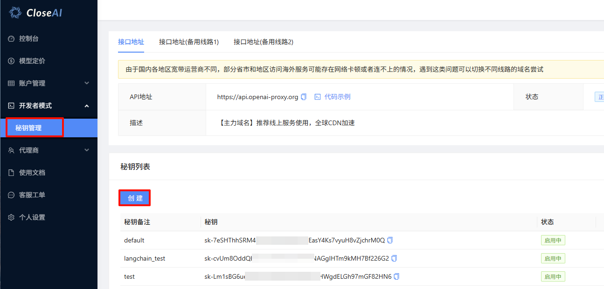

### 5.2 使用提示词模板

我们也可以创建prompt template, 并引入一些变量到prompt template中，这样在应用的时候更加灵活。

```python
from langchain_core.prompts import ChatPromptTemplate

# 需要注意的一点是，这里需要指明具体的role，在这里是system和用户
prompt = ChatPromptTemplate.from_messages([
    ("system", "你是世界级的技术文档编写者"),
    ("user", "{input}")  # {input}为变量
])

# 我们可以把prompt和具体llm的调用和在一起。
chain = prompt | llm
message = chain.invoke({"input": "大模型中的LangChain是什么?"})
print(message)

# print(type(message))
```

> ```
> LangChain是一个开源框架，旨在简化和增强大语言模型（如GPT-3、GPT-4 等）的开发与应用。它为开发者提供了一套工具和组件，使得在不同的用例中利用语言模型变得更加高效和灵活。LangChain 的全名是“Language Chain”，意在强调它将多个处理步骤或组件串联在一起，形成一个完整的处理链，以便更好地利用语言模型的能力。
> 
> ### LangChain 的主要特性包括：
> 
> 1. **组件化设计**：LangChain 提供了高度模块化的组件，允许开发者根据需要组合和扩展不同的功能，比如文本生成、数据提取、工具调用等。
> 
> 2. **链式调用**：可以将多个操作串联在一起，例如先生成文本，然后对生成的内容进行解析或处理，使得工作流程更加流畅。
> 
> 3. **多种后端支持**：LangChain 支持多种语言模型和生成后端，方便开发者在不同的平台和环境下进行开发。
> 
> 4. **集成外部工具**：LangChain 允许与外部API、数据库和其他工具集成，使得模型可以利用外部数据源和功能，增强其智能性和实用性。
> 
> 5. **可扩展性**：开发者可以通过自定义组件和方法，扩展 LangChain 的功能，以适应特定的业务需求。
> 
> ### 应用场景：
> 
> - **对话系统**：构建更智能的聊天机器人，能够理解上下文并进行多轮对话。
> - **内容生成**：生成文章、故事、产品描述等多种内容，并对其进行编辑和优化。
> - **数据提取和处理**：从大量文本中提取关键信息，并将其结构化。
> - **知识库查询**：结合语言模型与知识库，提供深度的知识查询和推荐。
> 
> 总之，LangChain 作为大模型应用的一个助手工具，提升了开发者的生产力，使得他们可以更专注于构建创新的应用，而不是陷入底层实现的复杂性中。
> 
> # <class 'langchain_core.messages.ai.AIMessage'>
> ```

### 5.3 使用输出解析器

```python
from langchain_openai import ChatOpenAI
from langchain_core.prompts import ChatPromptTemplate
from langchain_core.output_parsers import StrOutputParser,JsonOutputParser

# 初始化模型
llm = ChatOpenAI(model="gpt-4o-mini")

# 创建提示模板
prompt = ChatPromptTemplate.from_messages([
    ("system", "你是世界级的技术文档编写者。"),
    ("user", "{input}")
])

# 使用输出解析器
# output_parser = StrOutputParser()
output_parser = JsonOutputParser()

# 将其添加到上一个链中
# chain = prompt | llm
chain = prompt | llm | output_parser

# 调用它并提出同样的问题。答案是一个字符串，而不是ChatMessage
# chain.invoke({"input": "LangChain是什么?"})
chain.invoke({"input": "LangChain是什么? 用JSON格式回复，问题用question，回答用answer"})
```

> {'question': 'LangChain是什么?',
> 'answer': 'LangChain是一个开源框架，用于构建与大型语言模型（LLMs）交互的应用程序。它提供了一个灵活的工具集，允许开发人员创建具有复杂推理能力、链式任务处理和上下文管理的智能应用。LangChain支持多种数据源和组件，可以帮助开发者在各种环境中更高效地利用语言模型。'}

或

```python
from langchain_openai import ChatOpenAI
from langchain_core.prompts import ChatPromptTemplate
from langchain_core.output_parsers import StrOutputParser,JsonOutputParser

# 初始化模型
llm = ChatOpenAI(model="gpt-4o-mini")

# 创建提示模板
prompt = ChatPromptTemplate.from_messages([
    ("system", "你是世界级的技术文档编写者。输出格式要求：{format_instructions}"),
    ("user", "{input}")
])

# 使用输出解析器
# output_parser = StrOutputParser()
output_parser = JsonOutputParser()

# 将其添加到上一个链中
# chain = prompt | llm
chain = prompt | llm | output_parser

# 调用它并提出同样的问题。答案是一个字符串，而不是ChatMessage
# chain.invoke({"input": "LangChain是什么?"})
chain.invoke({"input": "LangChain是什么? ","format_instructions":output_parser.get_format_instructions()})
```

> {'LangChain': {'description': 'LangChain是一个开源的框架，用于构建基于语言模型的应用程序。它旨在将不同的语言模型、数据源和工具结合起来，以便于开发者创建复杂的应用。',
>   'key_features': ['模块化设计：支持将不同的组件组合在一起，如语言模型、数据处理和外部API。',
>    '支持多种语言模型：兼容不同类型的语言模型，如OpenAI的GPT系列、BERT等。',
>    '内置数据连接：可以与多种数据源进行集成，例如数据库、文件和外部API。',
>    '灵活的工作流管理：提供了多种方法来定义和管理任务的执行流程。',
>    '社区支持：拥有活跃的社区，提供文档、示例和支持。',
>    '可扩展性：允许开发者根据需求定制和扩展功能。'],
>   'use_cases': ['聊天机器人开发', '文本生成和摘要', '内容推荐系统', '自然语言理解任务', '自动化工作流处理'],
>   'getting_started': {'installation': '使用pip安装：pip install langchain',
>    'documentation_link': 'https://langchain.readthedocs.io/en/latest/'}}}

### 5.4 使用向量存储

使用一个简单的本地向量存储 FAISS，首先需要安装它

```bash
pip install faiss-cpu
#或者
conda install faiss-cpu
```

```bash
pip install langchain_community==0.3.7
#或者
conda install langchain_community==0.3.7
```

```python
# 导入和使用 WebBaseLoader
from langchain_community.document_loaders import WebBaseLoader
import bs4

loader = WebBaseLoader(
        web_path="https://www.gov.cn/xinwen/2020-06/01/content_5516649.htm",
        bs_kwargs=dict(parse_only=bs4.SoupStrainer(id="UCAP-CONTENT"))
    )
docs = loader.load()
# print(docs)

# 对于嵌入模型，这里通过 API调用
from langchain_openai import OpenAIEmbeddings

embeddings = OpenAIEmbeddings(model="text-embedding-ada-002")


from langchain_community.vectorstores import FAISS
from langchain_text_splitters import RecursiveCharacterTextSplitter

# 使用分割器分割文档
text_splitter = RecursiveCharacterTextSplitter(chunk_size=500, chunk_overlap=50)
documents = text_splitter.split_documents(docs)
print(len(documents))
# 向量存储  embeddings 会将 documents 中的每个文本片段转换为向量，并将这些向量存储在 FAISS 向量数据库中
vector = FAISS.from_documents(documents, embeddings)
```

> 248

### 5.5 RAG(检索增强生成)

基于外部知识，增强大模型回复

```python
from langchain_core.prompts import PromptTemplate

retriever = vector.as_retriever()
retriever.search_kwargs = {"k": 3}
docs = retriever.invoke("建设用地使用权是什么？")

# for i,doc in enumerate(docs):
#     print(f"⭐第{i+1}条规定：")
#     print(doc)

# 6.定义提示词模版
prompt_template = """
你是一个问答机器人。
你的任务是根据下述给定的已知信息回答用户问题。
确保你的回复完全依据下述已知信息。不要编造答案。
如果下述已知信息不足以回答用户的问题，请直接回复"我无法回答您的问题"。

已知信息:
{info}

用户问：
{question}

请用中文回答用户问题。
"""
# 7.得到提示词模版对象
template = PromptTemplate.from_template(prompt_template)

# 8.得到提示词对象
prompt = template.format(info=docs, question='建设用地使用权是什么？')

## 9. 调用LLM
response = llm.invoke(prompt)
print(response.content)
```

> 建设用地使用权是指在法律规定的范围内，建设用地使用权人对特定土地的使用、建造建筑物及其他设施的权利。根据相关法律规定，建设用地使用权可以通过出让或划拨等方式设立，并应当符合资源节约、生态环境保护及土地用途的规定。建设用地使用权人有权转让、出资、赠与或抵押其使用权，但需遵循法律规定和合同约定。

### 5.6 使用Agent

```python
from langchain.tools.retriever import create_retriever_tool

# 检索器工具
retriever_tool = create_retriever_tool(
    retriever,
    "CivilCodeRetriever",
    "搜索有关中华人民共和国民法典的信息。关于中华人民共和国民法典的任何问题，您必须使用此工具!",
)

tools = [retriever_tool]

from langchain import hub
from langchain.agents import create_openai_functions_agent
from langchain.agents import AgentExecutor

# https://smith.langchain.com/hub
prompt = hub.pull("hwchase17/openai-functions-agent")

agent = create_openai_functions_agent(llm, tools, prompt)
agent_executor = AgentExecutor(agent=agent, tools=tools, verbose=True)

# 运行代理
agent_executor.invoke({"input": "建设用地使用权是什么"})
```

> ```
> > Entering new AgentExecutor chain...
> 
> Invoking: `CivilCodeRetriever` with `{'query': '建设用地使用权'}`
> 
> 
> > Entering new AgentExecutor chain...
> 
> Invoking: `CivilCodeRetriever` with `{'query': '建设用地使用权'}`
> 
> 
> 第三百四十五条　建设用地使用权可以在土地的地表、地上或者地下分别设立。
> 第三百四十六条　设立建设用地使用权，应当符合节约资源、保护生态环境的要求，遵守法律、行政法规关于土地用途的规定，不得损害已经设立的用益物权。
> 第三百四十七条　设立建设用地使用权，可以采取出让或者划拨等方式。
> 工业、商业、旅游、娱乐和商品住宅等经营性用地以及同一土地有两个以上意向用地者的，应当采取招标、拍卖等公开竞价的方式出让。
> 严格限制以划拨方式设立建设用地使用权。
> 第三百四十八条　通过招标、拍卖、协议等出让方式设立建设用地使用权的，当事人应当采用书面形式订立建设用地使用权出让合同。
> 建设用地使用权出让合同一般包括下列条款：
> （一）当事人的名称和住所；
> （二）土地界址、面积等；
> （三）建筑物、构筑物及其附属设施占用的空间；
> （四）土地用途、规划条件；
> （五）建设用地使用权期限；
> （六）出让金等费用及其支付方式；
> （七）解决争议的方法。
> 第三百四十九条　设立建设用地使用权的，应当向登记机构申请建设用地使用权登记。建设用地使用权自登记时设立。登记机构应当向建设用地使用权人发放权属证书。
> 
> 第三百五十条　建设用地使用权人应当合理利用土地，不得改变土地用途；需要改变土地用途的，应当依法经有关行政主管部门批准。
> 第三百五十一条　建设用地使用权人应当依照法律规定以及合同约定支付出让金等费用。
> 第三百五十二条　建设用地使用权人建造的建筑物、构筑物及其附属设施的所有权属于建设用地使用权人，但是有相反证据证明的除外。
> 第三百五十三条　建设用地使用权人有权将建设用地使用权转让、互换、出资、赠与或者抵押，但是法律另有规定的除外。
> 第三百五十四条　建设用地使用权转让、互换、出资、赠与或者抵押的，当事人应当采用书面形式订立相应的合同。使用期限由当事人约定，但是不得超过建设用地使用权的剩余期限。
> 第三百五十五条　建设用地使用权转让、互换、出资或者赠与的，应当向登记机构申请变更登记。
> 第三百五十六条　建设用地使用权转让、互换、出资或者赠与的，附着于该土地上的建筑物、构筑物及其附属设施一并处分。
> 第三百五十七条　建筑物、构筑物及其附属设施转让、互换、出资或者赠与的，该建筑物、构筑物及其附属设施占用范围内的建设用地使用权一并处分。
> 
> 第三百五十八条　建设用地使用权期限届满前，因公共利益需要提前收回该土地的，应当依据本法第二百四十三条的规定对该土地上的房屋以及其他不动产给予补偿，并退还相应的出让金。
> 第三百五十九条　住宅建设用地使用权期限届满的，自动续期。续期费用的缴纳或者减免，依照法律、行政法规的规定办理。
> 非住宅建设用地使用权期限届满后的续期，依照法律规定办理。该土地上的房屋以及其他不动产的归属，有约定的，按照约定；没有约定或者约定不明确的，依照法律、行政法规的规定办理。
> 第三百六十条　建设用地使用权消灭的，出让人应当及时办理注销登记。登记机构应当收回权属证书。
> 第三百六十一条　集体所有的土地作为建设用地的，应当依照土地管理的法律规定办理。
> 第十三章　宅基地使用权
> 第三百六十二条　宅基地使用权人依法对集体所有的土地享有占有和使用的权利，有权依法利用该土地建造住宅及其附属设施。
> 第三百六十三条　宅基地使用权的取得、行使和转让，适用土地管理的法律和国家有关规定。
> > Entering new AgentExecutor chain...
> 
> Invoking: `CivilCodeRetriever` with `{'query': '建设用地使用权'}`
> 
> 
> 第三百四十五条　建设用地使用权可以在土地的地表、地上或者地下分别设立。
> 第三百四十六条　设立建设用地使用权，应当符合节约资源、保护生态环境的要求，遵守法律、行政法规关于土地用途的规定，不得损害已经设立的用益物权。
> 第三百四十七条　设立建设用地使用权，可以采取出让或者划拨等方式。
> 工业、商业、旅游、娱乐和商品住宅等经营性用地以及同一土地有两个以上意向用地者的，应当采取招标、拍卖等公开竞价的方式出让。
> 严格限制以划拨方式设立建设用地使用权。
> 第三百四十八条　通过招标、拍卖、协议等出让方式设立建设用地使用权的，当事人应当采用书面形式订立建设用地使用权出让合同。
> 建设用地使用权出让合同一般包括下列条款：
> （一）当事人的名称和住所；
> （二）土地界址、面积等；
> （三）建筑物、构筑物及其附属设施占用的空间；
> （四）土地用途、规划条件；
> （五）建设用地使用权期限；
> （六）出让金等费用及其支付方式；
> （七）解决争议的方法。
> 第三百四十九条　设立建设用地使用权的，应当向登记机构申请建设用地使用权登记。建设用地使用权自登记时设立。登记机构应当向建设用地使用权人发放权属证书。
> 
> 第三百五十条　建设用地使用权人应当合理利用土地，不得改变土地用途；需要改变土地用途的，应当依法经有关行政主管部门批准。
> 第三百五十一条　建设用地使用权人应当依照法律规定以及合同约定支付出让金等费用。
> 第三百五十二条　建设用地使用权人建造的建筑物、构筑物及其附属设施的所有权属于建设用地使用权人，但是有相反证据证明的除外。
> 第三百五十三条　建设用地使用权人有权将建设用地使用权转让、互换、出资、赠与或者抵押，但是法律另有规定的除外。
> 第三百五十四条　建设用地使用权转让、互换、出资、赠与或者抵押的，当事人应当采用书面形式订立相应的合同。使用期限由当事人约定，但是不得超过建设用地使用权的剩余期限。
> 第三百五十五条　建设用地使用权转让、互换、出资或者赠与的，应当向登记机构申请变更登记。
> 第三百五十六条　建设用地使用权转让、互换、出资或者赠与的，附着于该土地上的建筑物、构筑物及其附属设施一并处分。
> 第三百五十七条　建筑物、构筑物及其附属设施转让、互换、出资或者赠与的，该建筑物、构筑物及其附属设施占用范围内的建设用地使用权一并处分。
> 
> 第三百五十八条　建设用地使用权期限届满前，因公共利益需要提前收回该土地的，应当依据本法第二百四十三条的规定对该土地上的房屋以及其他不动产给予补偿，并退还相应的出让金。
> 第三百五十九条　住宅建设用地使用权期限届满的，自动续期。续期费用的缴纳或者减免，依照法律、行政法规的规定办理。
> 非住宅建设用地使用权期限届满后的续期，依照法律规定办理。该土地上的房屋以及其他不动产的归属，有约定的，按照约定；没有约定或者约定不明确的，依照法律、行政法规的规定办理。
> 第三百六十条　建设用地使用权消灭的，出让人应当及时办理注销登记。登记机构应当收回权属证书。
> 第三百六十一条　集体所有的土地作为建设用地的，应当依照土地管理的法律规定办理。
> 第十三章　宅基地使用权
> 第三百六十二条　宅基地使用权人依法对集体所有的土地享有占有和使用的权利，有权依法利用该土地建造住宅及其附属设施。
> 第三百六十三条　宅基地使用权的取得、行使和转让，适用土地管理的法律和国家有关规定。
> 第三百六十四条　宅基地因自然灾害等原因灭失的，宅基地使用权消灭。对失去宅基地的村民，应当依法重新分配宅基地。建设用地使用权是指在中华人民共和国法律框架下，个人或单位依法享有的对特定建设用地进行开发、建设和利用的权利。
> 
> 根据《中华人民共和国民法典》，建设用地使用权的相关规定主要包括以下几个方面：
> 
> 1. **设立与形式**：建设用地使用权可以通过出让或划拨等方式设立，通常需要通过招标、拍卖等公开方式进行。
> 
> 2. **合同与登记**：设立建设用地使用权时，需要书面订立相关合同，并向登记机构申请登记。只有登记后，建设用地使用权才正式成立，并会获得权属证书。
> 
> 3. **权利与义务**：建设用地使用权人有权合理利用土地，但不得随意改变土地用途，任何用途的改变都需获得相关主管部门的批准。此外，建设用地使用权人应按照合同约定支付出让金等费用。
> 
> 4. **转让与变更**：建设用地使用权可以进行转让、互换、出资、赠与或抵押，但必须遵循法律规定，并进行相应的登记。
> 
> 5. **期满续期**：住宅建设用地使用权在期满后会自动续期，而非住宅建设用地的续期需依照法律规定办理。
> 
> 这些规定旨在确保土地资源的合理利用与保护，同时维护用地权利人的合法权益。
> 
> > Finished chain.
> ```
>
> ```
> {'input': '建设用地使用权是什么',
>  'output': '建设用地使用权是指在中华人民共和国法律框架下，个人或单位依法享有的对特定建设用地进行开发、建设和利用的权利。\n\n根据《中华人民共和国民法典》，建设用地使用权的相关规定主要包括以下几个方面：\n\n1. **设立与形式**：建设用地使用权可以通过出让或划拨等方式设立，通常需要通过招标、拍卖等公开方式进行。\n\n2. **合同与登记**：设立建设用地使用权时，需要书面订立相关合同，并向登记机构申请登记。只有登记后，建设用地使用权才正式成立，并会获得权属证书。\n\n3. **权利与义务**：建设用地使用权人有权合理利用土地，但不得随意改变土地用途，任何用途的改变都需获得相关主管部门的批准。此外，建设用地使用权人应按照合同约定支付出让金等费用。\n\n4. **转让与变更**：建设用地使用权可以进行转让、互换、出资、赠与或抵押，但必须遵循法律规定，并进行相应的登记。\n\n5. **期满续期**：住宅建设用地使用权在期满后会自动续期，而非住宅建设用地的续期需依照法律规定办理。\n\n这些规定旨在确保土地资源的合理利用与保护，同时维护用地权利人的合法权益。'}
> ```

