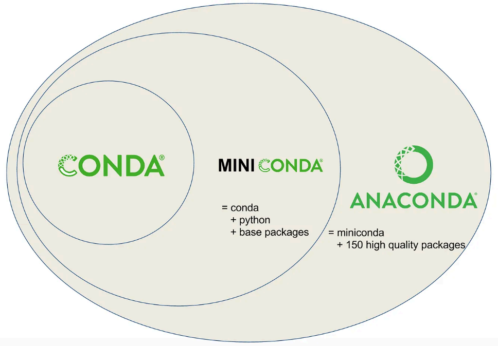

# 尚硅谷-conda使用指南

讲师：尚硅谷-宋红康

官网：[尚硅谷][https://www.atguigu.com/]

***

## 1. Conda 基本介绍

### 1.1 什么是 Conda、MiniConda、Anaconda



> Conda是一个包和环境管理的工具。支持 Windows、macOS和 Linux。Conda可以快速的安装、运行和更新包和相关的依赖。Conda也可以轻易地创建、保存、加载和转换环境。
>
> Anaconda是一个用于科学计算的 Python 发行版, 支持 Linux、Mac、Windows，包含了 conda、conda-build、Python和众多科学计算的包及其依赖。
>
> Miniconda 是一个 Anaconda的轻量级替代，默认只包含了 conda, Python和一些它们所以依赖的包。 

### 1.2  Anaconda 和 Miniconda 区别?

Miniconda是 Anaconda 的精简版本，同样也是一个开源环境，两者都是 conda系统的一部分。不同之处在于 Anaconda会预先安装许多常用的 Python套件，因此占用较多的硬盘空间。相比之下，Miniconda因为名为” Mini”，因此仅安装运行所需的基本套件，对于有多个不同 Python版本共存的情况，可以节省大量空间。

> Miniconda可以依据自己需求建立自己的 Python环境，想要的套件自行安装。

### 1.3 为什么要使用 Conda?

一个典型的 Python项目会使用多个包来完成其功能。其中一些包也可能被其他项目所使用 (共享)。

**项目之间共享的包可能会引起冲突。**

比如，我们有两个项目P1和P2，P1使用NumPy 1.2版本，而P2需要NumPy 1.3版本，一个环境中存在两个版本就可能导致冲突。解决这个问题的办法就是使用虚拟环境。我们可以为每个项目分别创建一个独立的虚拟环境，来隔离包冲突。


常用的 Python虚拟环境管理工具有：

1. Virtualenv
2. Conda
3. pipenv
4. venv

通过使用这些工具，我们可以很容易的创建虚拟环境。

 

## 2. Conda 安装

### 2.1 Miniconda 下载安装

官网下载地址:https://www.anaconda.com/download/success


 下载后依据指引进行 Miniconda 安装。

###  2.2 Anaconda的使用方式

#### 2.2.1 使用方式一： Anaconda Powershell Prompt终端


安装完成后，打开终端 `Anaconda Powershell Prompt,` 如果有看到命令列提示中的 (base)，那表示安装成功。


我们可以輸入 `python --version`确认 Python版本。


#### 2.2.2 使用方式二：环境变量→cmd终端使用

1. 若在安装时**勾选添加环境变量**，会在用户环境变量的Path中添加相应路径；

   若安装时没有勾选添加环境变量，则需要在安装后手动添加环境变量。

   Windows操作系统下同时按下“Win+S”打开搜索栏，搜索“编辑系统环境变量”可进入查看和编辑环境变量。

   

2. 单击右下角环境变量，双击上半部分用户变量中的Path，若先前安装时勾选了添加环境变量，在此可查看到已添加的路径。


3. 若先前安装时未勾选添加环境变量，则需找到先前安装时设定的Anaconda安装路径。此处为“D:\ProgramFiles\anaconda3”，需对照自己的安装路径，在环境变量中点击“新建”依次添加如下路径：

```
D:\ProgramFiles\anaconda3（Anaconda安装路径）
D:\ProgramFiles\anaconda3\Library\mingw-w64\bin（Anaconda安装路径\Library\mingw-w64\bin）
D:\ProgramFiles\anaconda3\Library\usr\bin（Anaconda安装路径\Library\usr\bin）
D:\ProgramFiles\anaconda3\Library\bin（Anaconda安装路径\Library\bin）
D:\ProgramFiles\anaconda3\Scripts（Anaconda安装路径\Scripts）
```

4. 按下“Win+R”，输入“cmd”，点击确定，打开命令提示符

​     

5. 输入conda info查看conda信息，输入`python --version`查看Python版本。Anaconda安装成功。

​     

## 3. Conda 常用命令

### 3.1 基本命令

```shell
conda -help            # 查看帮助

conda info             # 查看 conda 信息

conda --version        # 查看 conda 版本

conda update conda     # 更新 Conda (慎用)

conda clean -all      # 清理不再需要的包

conda <指令> --help     # 查看某一个指令的详细帮助

conda config --show    # 查看 conda 的环境配置

conda clean -p         # 清理没有用, 没有安装的包

conda clean -t         # 清理 tarball

conda clean --all      # 清理所有包和 conda 的缓存文件
```

 

### 3.2 环境管理

#### 3.2.1 创建 Conda 环境

 使用 conda可以在电脑上创建很多套相互隔离的 Python环境，命令如下：

```shell
# 语法
conda create --name < env_name> python=<version> [package_name1] [package_name2] [……]

# 样例 创建一个名为 learn 的环境, python 版本为3.10
conda create --name learn python=3.10 # --name 可以简写为 - n
```

####  3.2.2 切换 Conda环境

前面说到 Conda可以创建多套相互隔离的 Python环境，使用 `conda activate env_name` 可以切换不同的环境。

```shell
 #语法
conda activate env_name

#样例 切换到 learn 环境
conda activate learn
```

 如果要退出此环境，回到基础环境，可以使用如下命令

```shell
 #退出当前环境
conda deactivate
```

#### 3.2.3 查看 Conda 环境

当电脑上安装了很多台 Conda环境的时候，可以使用 `conda env list` 命令查看所有已创建的 Conda环境。

```shell
# 查看当前电脑上所有的 conda环境
conda env list
```

####  3.2.4 删除某个 Conda 环境

```shell
# 语法
conda remove --name <env_name> --all

# 样例
conda remove --name learn - - all
```

####  3.2.5 克隆环境

```shell
# 语法
conda create --name <new_evn_name> --clone <old_env_name>#样例
conda create --name myclone --clone myenv
```

### 3.3 包管理                  

一旦激活了环境，你就可以使用 `conda`和 `pip`在当前环境下安装你所需要的包。在conda环境中, 不建议使用 `pip`。

#### 3.3.1 安装包

在激活的环境中安装包，例如安装NumPy：

```bash
conda install numpy
```

 可以使用以下命令安装特定版本的包：

```bash
conda install numpy=1.18
```

#### 3.3.2 更新包

更新某个包到最新版本：

```shell
conda update numpy

#更新所有包到最新版本 (慎用)
conda update --all
```

执行命令后，conda将会对版本进行比较并列出可以升级的版本。同时，也会告知用户其他相关包也会升级到相应版本。当较新的版本可以用于升级时，终端会显示Proceed([y]/n)? , 此时输入y 即可进行升级。

#### 3.3.3 卸载包

如果不再需要某个包，可以将其卸载：

```shell
conda remove numpy
```

####  3.3.4 列出环境中的所有包

查看当前环境中已安装的所有包：

```shell
conda list
```

 查看当前虚拟环境中已安装的某个包的信息

```shell
conda list pip
```


####  3.3.5 搜索包

 搜索可用的包及其版本信息：

```shell
 conda search package-name
```


### 3.4 使用通道(忽略)

Conda通道 (Channel)是 Conda用来查找和下载软件包的源。通道就像是软件仓库，用户可以从这些通道中获取需要的软件包。理解和有效管理 Conda通道，可以帮助用户更好地控制软件包的来源、版本以及稳定性。

**主要通道**

- `默认通道`：这是 Conda自带的官方通道，由 Anaconda维护，包含了常用的数据科学和机器学习包。默认通道提供的包经过测试和优化，通常是稳定且值得信赖的。
- `Conda-Forge`: Conda-Forge是一个社区驱动的通道，拥有数量庞大的软件包和活跃的维护者社区。通常情况下，Conda-Forge提供更多的最新软件包版本，对于一些在默认通道中没有的包来说尤为重要。由于是社区维护，更新速度快，适合需要最新特性和支持的用户。
- `Bioconda`：专为生物信息学和生物数据分析设计的通道。包含很多用于生物数据处理和分析的工具。

**查看已配置的通道**

你可以使用以下命令查看当前配置的通道列表：

```bash
conda config --show channels
```

 **添加新的通道**

如果需要从其他通道安装包，可以将其添加到 Conda配置中。例如，添加 Conda-Forge:

```shell
conda config --add channels conda-forge
```

 **设置通道顺序**

通道是按顺序搜索的，优先使用在前面的通道。可以通过以下命令调整顺序：

```shell
conda config --set channel_priority strict
```

 使用 strict优先级时，Conda会严格按照通道顺序来选择包。

**删除通道**

 如果不需要某个通道，可以将其移除：

```shell
conda config --remove channels channel-name
```

 **临时使用特定通道**

你可以在安装包时临时指定通道，而不改变全局配置。例如：

```shell
conda install package-name -c conda-forge
```

这样做会从 Conda-Forge通道安装指定的包。

**通道优先级**

Conda允许设置通道优先级，以决定从哪个通道下载软件包。默认情况下，Conda会根据通道列表的顺序依次查找包。你可以通过以下命令启用或禁用通道优先级：

```shell
conda config --set channel_priority true # 启用优先级
conda config --set channel_priority false # 禁用优先级
```

 启用优先级后，Conda会严格根据通道顺序来选择包，确保从首选通道安装。

**创建自定义通道**

如果你需要在团队中共享包，或者需要托管私有包，可以创建自己的 Conda通道。自定义通道可以通过简单的HTTP服务器 (如NGINX或 Apache)托管，或者使用Anaconda的企业解决方案。

###  3.5 设置镜像

为了提高 Conda包的下载速度，特别是在网络连接到默认的 Conda服务器速度较慢的情况下，设置国内镜像 (或其他更接近你的地理位置的镜像)是一个常见且有效的方法。

以下是如何设置 Conda镜像的步骤：

**方法一：通过命令行配置**

你可以使用 conda config命令来添加镜像。例如,使用清华大学的 Anaconda镜像。

- 打开命令提示符或终端。
- 添加镜像URL:

```shell
conda config --add channels
https://mirrors.tuna.tsinghua.edu.cn/anaconda/pkgs/main
conda config --add channels
https://mirrors.tuna.tsinghua.edu.cn/anaconda/pkgs/free
conda config --add channels
https://mirrors.tuna.tsinghua.edu.cn/anaconda/pkgs/r
conda config --add channels
https://mirrors.tuna.tsinghua.edu.cn/anaconda/pkgs/pro
conda config --add channels
https://mirrors.tuna.tsinghua.edu.cn/anaconda/cloud/conda-forge
conda config --add channels
https://mirrors.tuna.tsinghua.edu.cn/anaconda/cloud/msys2
conda config --add channels
https://mirrors.tuna.tsinghua.edu.cn/anaconda/cloud/bioconda
conda config --add channels
https://mirrors.tuna.tsinghua.edu.cn/anaconda/cloud/menpo
conda config --set show_channel_urls yes
```

默认情况下，conda config添加的通道会排在列表的头部，但你可以通过以下命令来确认顺序：

```shell
conda config --show channels
```

 **方法二：通过修改配置文件**

你也可以直接修改 Conda的配置文件来设置镜像：

- 找到并编辑 Conda的配置文件: ~/. condarc (Linux和macOS) 或 C:\Users<用户名>. condarc (Windows) 。TUNA 提供了 Anaconda 仓库与第三方源(conda-forge、msys2、pytorch等, 各系统都可以通过修改用户目录下的. condarc文件来使用TUNA 镜像源。Windows用户无法直接创建名为. condarc的文件, 可先执行 conda config -set show_channel_urls yes 生成该文件之后再修改。
- 添加或修改如下内容：

```shell
channels:
	- defaults
show_channel_urls: true
default_channels:
	- https://mirrors.tuna.tsinghua.edu.cn/anaconda/pkgs/main
	- https://mirrors.tuna.tsinghua.edu.cn/anaconda/pkgs/r
	- https://mirrors.tuna.tsinghua.edu.cn/anaconda/pkgs/msys2
custom_channels:
	conda-forge: https://mirrors.tuna.tsinghua.edu.cn/anaconda/cloud
	msys2: https://mirrors.tuna.tsinghua.edu.cn/anaconda/cloud
	bioconda: https://mirrors.tuna.tsinghua.edu.cn/anaconda/cloud
	menpo: https://mirrors.tuna.tsinghua.edu.cn/anaconda/cloud
	pytorch: https://mirrors.tuna.tsinghua.edu.cn/anaconda/cloud
	pytorch-lts: https://mirrors.tuna.tsinghua.edu.cn/anaconda/cloud
	simpleitk: https://mirrors.tuna.tsinghua.edu.cn/anaconda/cloud
	deepmodeling:https://mirrors.tuna.tsinghua.edu.cn/anaconda/cloud/
```

 运行 `conda clean -i` 清除索引缓存，保证用的是镜像站提供的索引。

验证和测试

在设置完镜像后，你可以通过安装软件包来测试镜像是否工作正常。例如：

```shell
conda install numpy
```

查看输出的信息，确保包是从你设置的镜像URL下载的。

###  3.6 环境导入与导出(忽略)

**导出环境**

将当前环境导出为一个YAML文件，方便共享：

```shell
conda env export > environment.yml
```

 **从文件创建环境**

使用YAML文件创建一个新环境：

```shell
conda env create - f environment.yml
```


##  4. Mamba 使用(忽略)

Mamba是一个用于管理 Conda环境和包的开源工具，旨在解决 Conda在处理大型环境时的速度和性能问题。它与 Conda兼容，但提供更快的依赖解析和包安装，这使得它在处理复杂环境时更加高效。

**Mamba的关键特点**

- 快速的依赖解析：Mamba使用一个高效的C++库进行依赖解析，这使得在面对复杂的包依赖时能更快地找到解决方案。
- 并行下载：Mamba可以并行下载和安装包，这大大减少了安装时间，特别是在需要下载大量包的情况下。
- 与 Conda兼容: Mamba可以无缝替代 Conda的命令, 你可以在几乎所有 Conda命令中直接使用 mamba来替换 conda。
- 更好的用户体验：提供更直观的输出信息和进度条，让用户可以更清晰地了解安装进度和过程。

**安装 Mamba**

要安装 Mamba，你首先需要一个 Conda环境。以下是在已有 Conda环境中安装Mamba的步骤:

如果你希望在特定环境中安装 Mamba，可以先激活该环境：

```bash
conda activate myenv
```

 你可以通过 Conda-Forge通道安装 Mamba, 因为 Mamba在该通道上维护得很好:

```bash
conda install mamba -n base -c conda-forge
```

这里-n base表示将 Mamba安装在 base环境中，这样你可以在任何环境中使用Mamba。

**使用 Mamba**

Mamba可以直接替代 Conda的命令。以下是一些常见的 Conda命令及其 Mamba等效用法：

- 创建环境: mamba create -name myenv python=3.8
- 激活环境: conda activate myenv (Mamba不改变环境激活命令, 你仍然使用Conda的激活命令)
- 安装包: mamba install numpy
- 更新包: mamba update numpy
- 删除包: mamba remove numpy
- 更新环境中的所有包: mamba update -all

**优势：**

- 速度：Mamba在处理包管理和环境解决时速度快得多，这对大环境尤其有用。
- 效率：并行下载和安装机制使得整体过程更加高效。
- 兼容性：能够无缝替代 Conda，并与其生态系统兼容。

**局限性：**

- 新兴工具：作为一个较新的工具，Mamba可能在某些边缘情况下不如 Conda稳定。
- 社区支持：虽然 Mamba的社区在快速增长，但它仍然没有 Conda那么成熟。

##  5. Jupyter Lab 使用

### 5.1 Jupyter 介绍

JupyterLab 是最新的基于 Web 的交互式开发环境, 适用于 notebooks、代码和数据。其灵活的界面允许用户配置和安排数据科学、科学计算、计算新闻和机器学习中的工作流程。模块化设计允许扩展来扩展和丰富功能。


### 5.2 Jupyter 安装使用           

使用安装JupyterLab: `pip`

```bash
 pip install jupyterlab
```

**注意:** 如果您使用 conda 或 mamba 安装JupyterLab, 我们建议使用 `conda-forge`通道。

安装后, 使用以下命令启动JupyterLab：

```shell
 jupyter lab
```


##  6. PyCharm 中使用 Conda 环境 

1) 创建项目所需要的虚拟环境

```shell
conda create -n llamaindex-rag python=3.10
```

 2) 创建项目，选择 自定义环境，类型选择 Conda, 环境选择 llamaindex-rag，点击 **创建** 即可

> 此处缺一截图


3) **查看项目环境配置**

> 此处缺一截图


注意: 项目中需要另外的依赖库, 直接到 Conda Powershell Prompt终端下, 激活 llamaindex-rag环境, 使用 pip 安装依赖库即可!